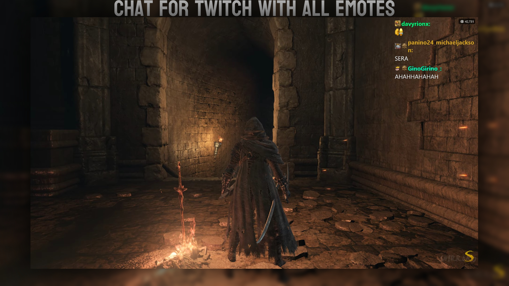
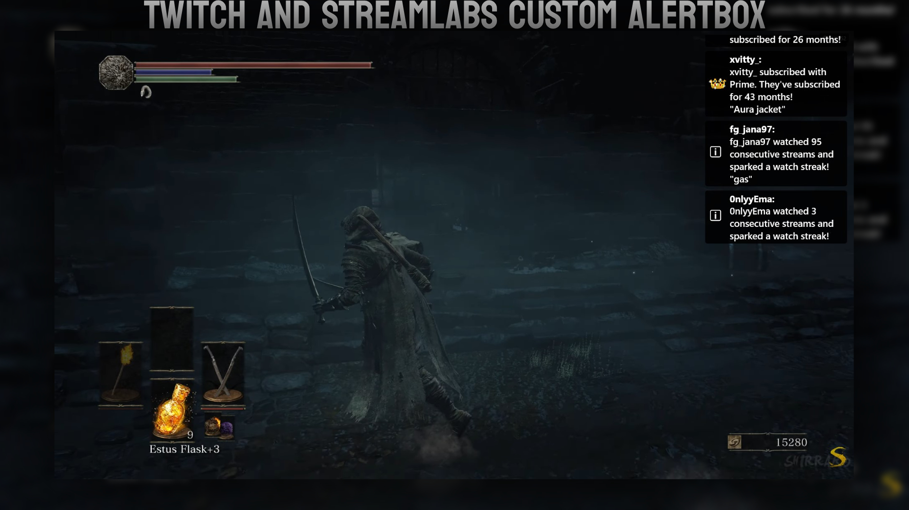
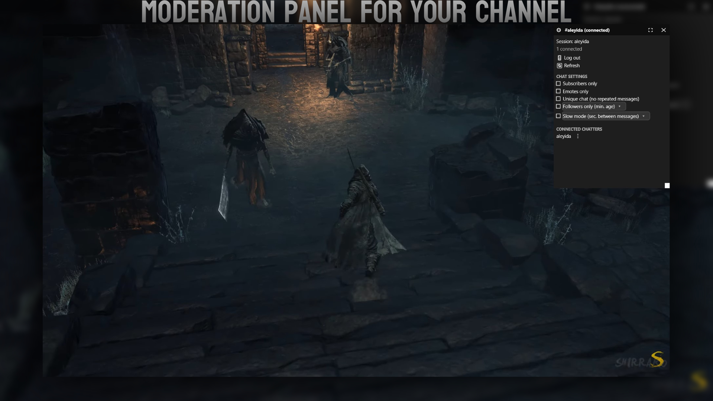
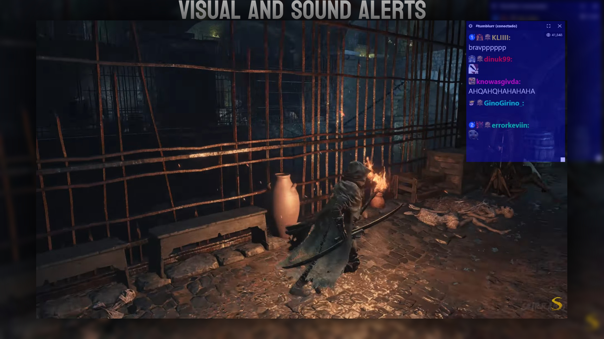

<div align="center">
  

  # TTNOverlay

  A multi-function Twitch & Kick overlay for Windows: live chat, event alerts, viewer count, and in-app moderation. Transparent, click-through, fully customizable!

  <a href="https://github.com/1devLion/TTNOverlay/releases/latest">
    
  </a>
  <a href="https://github.com/1devLion/TTNOverlay/issues?q=is%3Aissue+is%3Aopen+sort%3Aupdated-desc">
    
  </a>
  <br/>
  <a href="https://ko-fi.com/enubia">
    
  </a>

  ---

  Live chat, event alerts, viewer count, and in-app moderation. Drawn as a transparent, click-through window right on top of whatever you're playing. Chat works with no login at all. Sign in only for viewer count, badges, and moderation.


</div>

## Screenshots

<div align="center">
  
  
  <br/><br/>
  
  
</div>

## Features

- **Multichat**: watch Twitch and Kick chat together in one window, with a small badge on each message showing where it came from
- **Chat**: Twitch emotes, badges, and third-party emotes from BTTV, FFZ, and 7TV
- **Event alerts**: subs, resubs, raids, and announcements straight from IRC. Donations, follows, hosts, and merch from Streamlabs if you connect it. Events reported by both sources get merged, not shown twice
- **In-app moderation**: timeout, ban, warn, and unban without ever tabbing out of your game (needs a moderator or broadcaster login)
- **Viewer count & badges**: shown once you sign in, now combining Twitch and Kick viewer counts (YouTube support coming)
- **Connection status at a glance**: a small colored dot in the title bar shows whether chat is connected, connecting, or disconnected
- **Sound & flash alerts**: every event type gets its own color and can trigger a sound or a screen flash
- **Custom alert colors**: pick any RGB for each visual alert
- **Custom event colors**: color the event box per event type *and* per source (Streamlabs vs IRC)
- **Custom event GIFs**: swap in your own GIF for any event type, right from Settings
- **Custom alert sounds**: default presets included, or bring your own
- **Streamlabs integration**: unlock its alert box events (donations, custom messages, GIFs) via Widget Token + Socket API Token. One-click login coming soon
- **Dark/Light theme**, switchable live
- Multi-language support **(EN/ES/PT/DE/FR/JA/ZH/RU)**

---

### Download

| Platform | Download                                                                           |
| -------- | ---------------------------------------------------------------------------------- |
| Windows  | [TTNOverlay-win-Setup.exe](https://github.com/1devLion/TTNOverlay/releases/latest) |

Installs to your user profile (no admin required) and updates itself automatically.

## Build

If you want to build it yourself (needs the .NET 10 SDK):

```powershell
dotnet publish TTNOverlay.csproj -c Release -o publish -r win-x64 --self-contained true
```

To package it as an installer like the one in Releases, you'll also need the [Velopack CLI](https://docs.velopack.io/):

```powershell
dotnet tool install -g vpk
vpk pack -u TTNOverlay -v <version> -p publish -e TTNOverlay.exe --icon Resources\icon.ico --splashImage Resources\install_splash.gif --packTitle "TTNOverlay" 
```

## Stack

- .NET 10, Win32 (P/Invoke) + **Vortice.Direct2D1** for a layered, GPU-drawn window.
- Twitch **IRC over WebSocket** for chat (anonymous, no login required)
- **Kick chat** over its Pusher WebSocket, with a browser-TLS-fingerprint HTTPS client (via BouncyCastle) to get past Cloudflare's bot protection
- Twitch **Helix API** + user OAuth for viewer count, badges, and moderation
- **Streamlabs Socket API** (optional) for donations, follows, hosts, and merch
- Cloudflare Worker as OAuth token broker (keeps the Twitch client secret off the client)

## License
MIT licensed, see more [here](https://github.com/1devLion/TTNOverlay/blob/main/LICENSE)