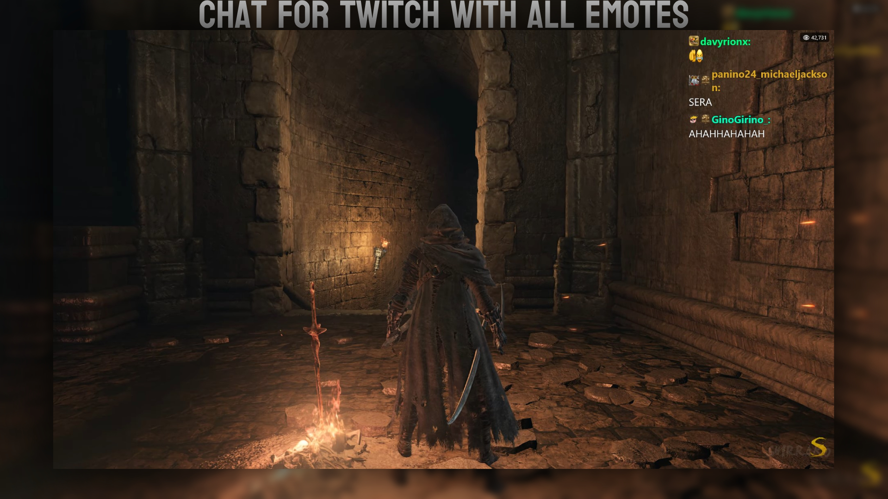
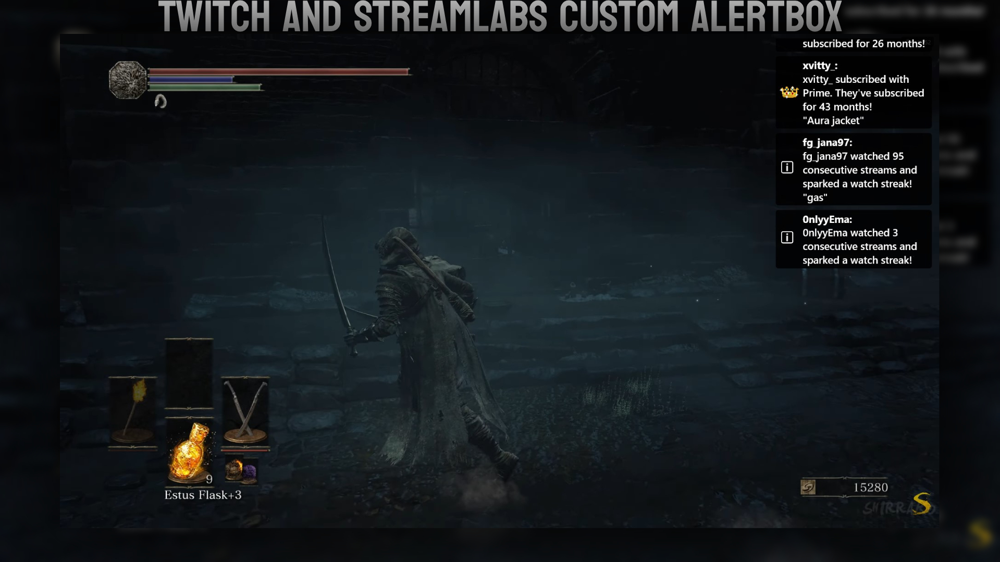
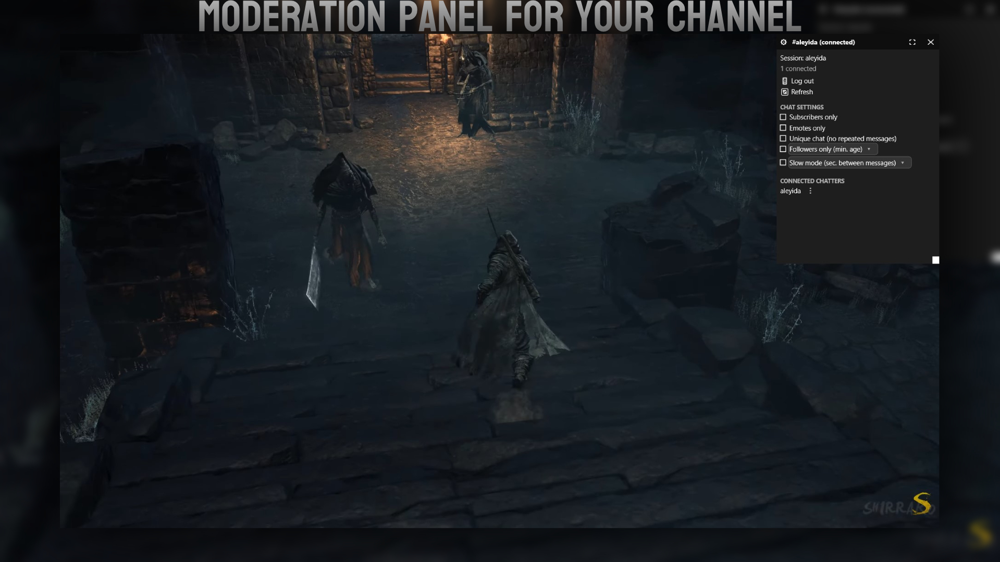
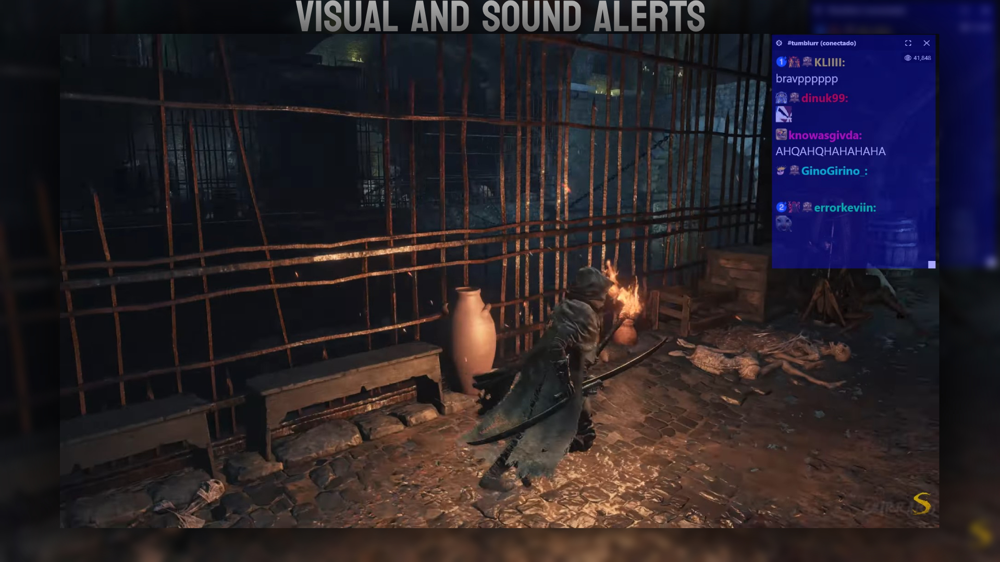

<div align="center">
  

  # TTNOverlay

  A multi-function Twitch overlay for Windows: live chat, event alerts, viewer count, and in-app moderation — transparent, click-through, and more.

</div>

<div align="center">
  
  
  <br/><br/>
  
  
</div>

## Stack

- .NET 10, Win32 (P/Invoke) + **Vortice.Direct2D1** for a layered, GPU-drawn window.
- Twitch **IRC over WebSocket** for chat (anonymous, no login required)
- Twitch **Helix API** + user OAuth for viewer count, badges, and moderation
- **Streamlabs Socket API** (optional) for donations, follows, hosts, and merch
- Cloudflare Worker as OAuth token broker (keeps the Twitch client secret off the client)

## Features

- **Chat**: Twitch emotes, badges, and third-party emotes (BTTV/FFZ/7TV)
- **Events**: subs, resubs, raids, and announcements from IRC; donations/follows/hosts/merch from Streamlabs if connected, deduplicated when both sources report the same event
- **Moderation panel**: timeout, ban, warn, unban — requires logging in with a moderator/broadcaster Twitch account
- **Viewer count** and **chat badges**, shown once logged in
- Configurable **sound and flash alerts** for messages and events
- Dark/Light theme, switchable live
- English/Spanish UI
- Borderless mode + click-through, so mouse input passes through to whatever's underneath
- Fully configurable from an in-app settings panel (General, Hotkeys, Twitch API, Streamlabs, Alerts, Audio, About)

## Global hotkeys

Configurable in Settings → Hotkeys. Defaults:

| Hotkey            | Action                         |
| ----------------- | ------------------------------ |
| **Ctrl+Shift+F7** | Toggle borders / click-through |
| **Ctrl+Shift+F8** | Toggle chat ↔ events dashboard |
| **Ctrl+Shift+F9** | Toggle chat ↔ moderation panel |

Registered via Win32 `RegisterHotKey`, so they work even while a game has focus.

## Twitch login (optional)

Only needed for viewer count, badges, and moderation — chat itself works anonymously. Log in from Settings → Twitch API or from the moderation panel.

## Build & run

```powershell
dotnet run
```

Or open `TTNOverlay.sln` in Visual Studio 2022+ and build with F5.

### Publish a portable .exe

```powershell
dotnet publish -c Release -r win-x64 --self-contained true -p:PublishSingleFile=true -p:IncludeNativeLibrariesForSelfExtract=true
```

Self-contained: no .NET runtime required on the end user's machine.

## Structure

```
Overlay/            native windows: main overlay, settings, moderation, rendering, controls
Twitch/             IRC client, Helix API, OAuth
Streamlabs/         Socket API client + event mapping
Services/           settings, moderation, theming, localization, caching, audio, logging
Models/             chat message and color models
Native/              Win32 interop (hotkeys, DWM)
```